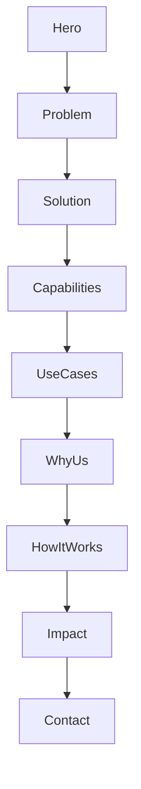

# MaestrosAI (Next.js) Website Plan

## What we’re building

A scalable B2B marketing website in your existing Next.js repo (`app/` already present) with:

- **App Router + TypeScript** (already)
- **Tailwind CSS v4 token-based design system** via `@theme` in `[app/globals.css](c:\Users\rohan.yashraj.gupta\OneDrive%20-%20Accenture\Documents\Work\GitHub\next-apps\maestrosai.in\app\globals.css)`
- **Component-driven marketing sections** that mirror insureai.co’s flow (hero → problem → solution → capabilities → use cases → why us → how it works → impact → contact)
- **Repo-based MDX Insights/blog** (typed content recommended via Contentlayer2)
- **Primary conversion**: secure contact/demo request form (server-side validation, spam protection, email delivery hook)

## Phased delivery (for tracking + control)

Each phase is a shippable milestone with explicit exit criteria. This lets you pause after any phase, review, and decide what to tackle next.

### Phase 0 — Foundation (project skeleton)

- **Scope**:
  - Route groups + page shells
  - Global marketing layout (Navbar/Footer framing)
  - Base folder structure (components/content/lib) without deep styling
- **Deliverables**:
  - Working routes for the sitemap stubs
  - Navigation + footer wired to routes
  - Content “source of truth” folder structure created (even if lightly populated)
- **Exit criteria**:
  - `npm run dev` renders the new home shell and all core pages without 404s
  - Nav/footer links correct and consistent
- **Out of scope**:
  - Final visuals, motion polish, deep copy refinement

### Phase 1 — Design system + UI primitives

- **Scope**:
  - Tailwind v4 `@theme` tokens in `app/globals.css`
  - Typography pairing, spacing scale, layout grid, button styles
  - Reusable primitives: `Container`, `Section`, `Button`, `Card`, `Input`, `Textarea`, `Select`
- **Deliverables**:
  - A cohesive “enterprise-trust” look & feel applied consistently
  - Primitives used by marketing sections (no copy duplication in components)
- **Exit criteria**:
  - Lighthouse Accessibility baseline green (no major contrast/focus issues)
  - Primitives documented via prop types and used across pages

### Phase 2 — Marketing pages (core narrative)

- **Scope**:
  - Home page composed in insureai-like flow (hero → problem → solution → capabilities → use cases → why us → how it works → impact → contact CTA)
  - Supporting pages: `/solutions`, `/capabilities`, `/use-cases`, `/how-it-works`, `/impact`
  - Copy centralized (e.g., `content/marketing/`*) so edits don’t require editing components
- **Deliverables**:
  - Complete v1 marketing narrative with original MaestrosAI copy
  - Reusable marketing components: Hero, FeatureGrid, UseCaseCards, HowItWorks, ImpactExamples, CTA banner
- **Exit criteria**:
  - All core pages feel consistent and “complete” (no placeholder blocks)
  - CTAs always point to `/contact#demo`

### Phase 3 — Conversion (contact form + backend)

- **Scope**:
  - `/contact` page with form UX (short, enterprise-friendly)
  - `/api/contact` route with server-side validation (`zod`)
  - Spam protection (Turnstile recommended) + basic rate limiting
  - Env-based email delivery hook (Resend/SMTP) and structured event logging
- **Deliverables**:
  - Working end-to-end lead capture: submit → success state → email delivery
  - UTM capture (hidden fields) for attribution
- **Exit criteria**:
  - Form is resilient (handles errors, retries, shows clear feedback)
  - No secrets in client code; env parsing is typed/validated

### Phase 4 — Insights (MDX)

- **Scope**:
  - MDX pipeline (recommended Contentlayer2) for typed frontmatter + build-time compilation
  - `/insights` index and `/insights/[slug]` article pages
  - Article metadata + JSON-LD
- **Deliverables**:
  - At least 2–3 sample insights posts (original) demonstrating structure and SEO
  - Tag/category support (optional in v1, but structure prepared)
- **Exit criteria**:
  - Article pages render in RSC safely, with correct canonical + OG tags

### Phase 5 — SEO/performance + launch hardening

- **Scope**:
  - `robots.ts`, `sitemap.ts`, base metadata defaults
  - Organization/WebSite structured data globally; Article structured data for insights
  - Performance pass: images, fonts, bundle hygiene, deferred analytics
  - Analytics events: `cta_click`, `contact_submit`, `contact_success`, `insight_view`
- **Deliverables**:
  - Production readiness checklist completed
  - Clear “launch config” via env vars (analytics IDs, email provider, Turnstile keys)
- **Exit criteria**:
  - Lighthouse Performance/SEO pass is acceptable for a marketing baseline
  - No blocking third-party scripts on initial render

## 1) Website architecture

### Sitemap (v1)

- **/** (Home / Marketing narrative)
- **/solutions** (Solution overview: offerings + engagement models)
- **/capabilities** (Technical capabilities: explainability, compliance, MLOps, integrations)
- **/use-cases** (Underwriting, Claims, Actuarial analytics, Ops automation)
- **/how-it-works** (Discovery → build → validate → deploy → measure)
- **/impact** (Case-style impact examples; measurable outcomes)
- **/insights** (Index)
- **/insights/[slug]** (MDX article)
- **/contact** (Demo/contact form)
- **/privacy**, **/terms**

### Navigation (top)

- **Solutions** (`/solutions`)
- **Capabilities** (`/capabilities`)
- **Use cases** (`/use-cases`)
- **Insights** (`/insights`)
- **Contact** (`/contact`)
- **Primary CTA button**: “Request a demo” → `/contact#demo`

### Footer structure

- **Solutions**: Platform layer, Automation, Analytics, Modernization
- **Use cases**: Underwriting, Claims, Actuarial, Ops
- **Company**: About (v2), Security (v2), Careers (optional)
- **Resources**: Insights, Contact
- **Legal**: Privacy, Terms

### CTAs (clear + consistent)

- **Primary (site-wide)**: “Request a demo”
- **Secondary (contextual)**: “See use cases”, “Talk to an expert”, “Read insights”
- **Form CTA copy**: “Get a tailored walkthrough”

### IA flow (mirrors insureai.co, adapted)




## 2) Content strategy (original MaestrosAI copy)

Below is **v1 copy** that maps 1:1 to the insureai.co narrative structure but is specific to MaestrosAI’s positioning (custom AI for insurers; compliance + explainability + measurable ops outcomes).

### Home page sections

#### Hero

- **Headline**: “AI systems insurers can trust—built for underwriting, claims, and actuarial decisioning.”
- **Subhead**: “MaestrosAI designs and deploys customized AI layers that reduce time to market, automate repetitive workflows, and improve decision quality—without compromising compliance, auditability, or explainability.”
- **Primary CTA**: “Request a demo”
- **Secondary CTA**: “Explore use cases”
- **Trust line**: “Designed for enterprise constraints: data privacy, model governance, and regulator-ready explanations.”

#### Problem statement (the friction)

- **Title**: “Insurance decisions are getting harder—your systems aren’t.”
- **Body**: “Executives need faster outcomes, actuaries need defensible assumptions, and operations teams need throughput. Legacy platforms and manual processes create a decision burden that slows growth and increases leakage.”
- **Bullets**:
  - “Slow product iteration and pricing refresh cycles”
  - “Claims triage bottlenecks and inconsistent handling”
  - “Underwriting decision drift across teams and channels”
  - “Analytics locked in spreadsheets and brittle pipelines”

#### Solution overview

- **Title**: “A practical AI layer over your existing stack.”
- **Body**: “We don’t ask you to rip-and-replace. We integrate with your policy, claims, and data platforms to deliver AI assistants, decision engines, and analytics workflows—built for your underwriting rules, your data, and your governance.”
- **3 pillars**:
  - **Decisioning**: “Explainable risk signals, rule + model orchestration, human-in-the-loop controls.”
  - **Automation**: “Document intake, extraction, summarization, routing, and task automation.”
  - **Analytics**: “Actuarial-grade validation, monitoring, and portfolio insight surfaces.”

#### Key capabilities

- **Title**: “Capabilities engineered for compliance and scale.”
- **Cards (examples)**:
  - “Underwriting copilot (triage, evidence gathering, rationale)”
  - “Claims automation (intake → summarization → next-best-action)”
  - “Actuarial analytics (experience studies, trend detection, scenario tools)”
  - “Legacy modernization (AI layer + APIs + workflow orchestration)”
  - “Governance & explainability (audit trails, reason codes, thresholds)”
  - “MLOps & monitoring (drift, performance, bias, SLA dashboards)”

#### Use cases (role-based)

- **Insurance executives**: “Ship changes faster; improve operational KPIs; create a measurable AI roadmap.”
- **Chief actuaries**: “Defensible models and assumptions; faster analyses; regulator-ready documentation.”
- **Heads of underwriting**: “Reduced cycle time; consistent decisions; fewer manual touches.”
- **Claims leaders**: “Higher throughput; better segmentation; reduced leakage; improved customer experience.”
- **Innovation teams**: “Pilot-to-production delivery with governance baked in.”

#### Why MaestrosAI

- **Title**: “Built for real-world insurance constraints.”
- **Proof points**:
  - “Customized solutions—no generic ‘one-size’ AI.”
  - “Explainable outputs and audit trails by default.”
  - “Integration-first delivery: APIs, workflows, and data contracts.”
  - “Operational impact focus: cycle time, accuracy, leakage, satisfaction.”

#### How it works

- **Step 1 — Discover**: “Process mapping, data readiness, target KPIs, governance requirements.”
- **Step 2 — Design**: “Solution blueprint: decision points, human controls, integrations.”
- **Step 3 — Build**: “Models + rules + workflow orchestration, evaluation harness, security.”
- **Step 4 — Validate**: “Backtesting, bias checks, explainability review, sign-off.”
- **Step 5 — Deploy & monitor**: “Controlled rollout, observability, drift monitoring, iteration.”

#### Impact examples (case-style, quantified placeholders)

- “Reduced underwriting turnaround from days to hours through automated evidence collection and triage.”
- “Improved claims routing accuracy and reduced manual rework with automated summaries and next-best-action suggestions.”
- “Accelerated pricing refresh cycles by automating experience analysis pipelines and surfacing actionable portfolio signals.”

#### Contact/demo

- **Title**: “See MaestrosAI on your workflows.”
- **Body**: “Tell us your line of business and where decisions stall. We’ll show a tailored walkthrough and a pragmatic path to production.”
- **Form fields** (recommended): name, work email, company, role, area (Underwriting/Claims/Actuarial/Other), message.

### Other core pages (copy direction)

- **Solutions**: Break into engagement models: “AI Layer & Integrations”, “Workflow Automation”, “Actuarial Analytics”, “Modernization Program”.
- **Capabilities**: Deep technical credibility (governance, model risk management, explainability patterns, evaluation, monitoring, security).
- **Use-cases**: Group by function + key workflows.

## 3) Technical architecture (implementation-oriented)

### Content approach (your choice: MDX)

- **Marketing pages**: TSX page components pulling copy from `content/marketing/*.ts` (easy reuse across sections and future pages).
- **Insights/blog**: MDX files in `content/insights/*.mdx`.
- **Typed content (recommended)**: add **Contentlayer2** so MDX/frontmatter becomes typed data for server components and SEO.
  - Alternative (simpler): use `@next/mdx` only + manual frontmatter parsing.

### Contact form (primary conversion)

- **Route handler**: `app/api/contact/route.ts` (server-only)
- **Validation**: `zod`
- **Spam**: Cloudflare Turnstile (recommended) or honeypot + rate-limit.
- **Delivery**: start with “send email” via Resend/SMTP (env-driven), later add CRM.

### SEO best practices (Next.js App Router)

- Per-route `export const metadata` (titles, descriptions, OpenGraph, Twitter)
- `app/robots.ts` and `app/sitemap.ts`
- Structured data:
  - Organization + WebSite (global)
  - Article JSON-LD for insights posts
- OG images: `app/opengraph-image.tsx` and per-post OG generation (v2)

### Folder structure (proposed)

- `app/(marketing)/` pages + layouts
- `app/(legal)/privacy/page.tsx`, `app/(legal)/terms/page.tsx`
- `app/(blog)/insights/page.tsx`, `app/(blog)/insights/[slug]/page.tsx`
- `components/`:
  - `components/nav/Navbar.tsx`
  - `components/footer/Footer.tsx`
  - `components/marketing/`* (Hero, FeatureGrid, UseCaseCards, etc.)
  - `components/ui/`* (Button, Container, Section, Card, Input…)
- `content/marketing/home.ts` (home copy in one object)
- `content/insights/*.mdx` (insights)
- `lib/`:
  - `lib/env.ts` (typed env parsing)
  - `lib/seo.ts` (helpers)
  - `lib/contact.ts` (email + validation)

## 4) Design system (AI + insurance, enterprise-trust)

### Design direction (“Precision Ledger”)

- Visual language inspired by **actuarial grids, ledgers, and audit trails** + subtle “AI” signal (contour lines / soft spectral accents), avoiding cliché purple gradients.

### Color palette (tokens)

- **Ink (primary text)**: deep navy/charcoal
- **Surface**: off-white with slight cool tint
- **Muted**: slate
- **Accent**: teal/cyan (confidence + modernity)
- **Highlight**: restrained amber (attention without “startup neon”)

### Typography

- **Body**: IBM Plex Sans (trustworthy, technical)
- **Headings**: IBM Plex Serif (enterprise/editorial authority)
- Keep mono only for small technical callouts.

### Buttons

- **Primary**: solid accent background, high contrast, subtle hover lift
- **Secondary**: outline + ink text
- **Tertiary**: text button with underline on hover

### Spacing & layout

- 4px base scale; sections generally `py-20 md:py-28`
- Grid: max width ~1200–1280px, 12-col mental model, cards in 3-up/2-up/1-up

### Motion

- Minimal, “enterprise calm”: opacity + translate, staggered reveals, no heavy JS.
- Respect `prefers-reduced-motion`.

### Accessibility

- AA contrast targets, visible focus rings, keyboard-safe menus/forms.

## 5) Component planning (reusable + typed props)

### Core UI primitives

- `Container({ size?: 'default'|'wide', className?, children })`
- `Section({ id?, eyebrow?, title, description?, children, variant?: 'default'|'muted'|'ink' })`
- `Button({ intent?: 'primary'|'secondary'|'ghost', size?: 'sm'|'md'|'lg', href?, onClick?, icon?, children })`
- `Card({ as?: 'div'|'a', href?, children, className? })`

### Marketing components

- `Hero({ headline, subhead, primaryCta, secondaryCta, bullets?, visual?: 'grid'|'contours' })`
- `ProblemStrip({ title, points: {title, description}[] })`
- `SolutionOverview({ title, body, pillars: {title, description, items[]}[] })`
- `FeatureGrid({ title, features: {title, description, icon?}[] })`
- `UseCaseCards({ items: {audience, outcomes[]}[] })`
- `WhyUs({ points: {title, description}[] })`
- `HowItWorks({ steps: {title, description, deliverables[]}[] })`
- `ImpactExamples({ items: {metric, context, note?}[] })`
- `CtaBanner({ title, description, cta })`
- `ContactForm({ defaultArea?, utm?: Record<string,string> })` (client)

## 6) Conversion strategy

- **Primary conversion goal**: qualified demo requests via `/contact`.
- **Secondary**: “Insights subscription” (v2) or “Download 1-page overview” (optional gated asset).
- **Lead capture strategy**:
  - Short form + role/area selection for routing.
  - Auto-capture UTM params into hidden fields.
  - Immediate confirmation + follow-up email.
- **Analytics**:
  - Add GA4 + LinkedIn Insight (deferred load)
  - Track events: `cta_click`, `contact_submit`, `contact_success`, `insight_view`.

## 7) Performance & SEO checklist (actionable)

- **RSC-first**: keep most marketing pages server components; only navbar menu + contact form as client.
- **Images**: `next/image`, explicit sizes, `priority` only for hero.
- **Fonts**: `next/font` with subsets; avoid loading too many weights.
- **Metadata**: stable canonical URLs; avoid duplicate titles.
- **Structured data**: Organization + Article.
- **Core Web Vitals**:
  - Avoid heavy motion libs; prefer CSS.
  - Defer analytics via dynamic import.

## Sample code snippets (for scaffold)

These are the “shape” we’ll scaffold after you accept the plan.

### Marketing route group layout

```tsx
// app/(marketing)/layout.tsx
import type { ReactNode } from 'react'
import { Navbar } from '@/components/nav/Navbar'
import { Footer } from '@/components/footer/Footer'

export default function MarketingLayout({ children }: { children: ReactNode }) {
  return (
    <>
      <Navbar />
      {children}
      <Footer />
    </>
  )
}
```

### Home page composition

```tsx
// app/(marketing)/page.tsx
import { Hero } from '@/components/marketing/Hero'
import { home } from '@/content/marketing/home'

export default function HomePage() {
  return (
    <main>
      <Hero {...home.hero} />
      {/* Problem, Solution, Capabilities, UseCases, WhyUs, HowItWorks, Impact, CTA */}
    </main>
  )
}
```

### Hero props shape

```ts
// components/marketing/Hero.tsx
export type HeroProps = {
  headline: string
  subhead: string
  primaryCta: { label: string; href: string }
  secondaryCta?: { label: string; href: string }
  bullets?: string[]
}
```

## Repo-specific notes (what we’ll change)

- Current pages are the default create-next-app template:
  - `[app/page.tsx](c:\Users\rohan.yashraj.gupta\OneDrive%20-%20Accenture\Documents\Work\GitHub\next-apps\maestrosai.in\app\page.tsx)`
  - `[app/layout.tsx](c:\Users\rohan.yashraj.gupta\OneDrive%20-%20Accenture\Documents\Work\GitHub\next-apps\maestrosai.in\app\layout.tsx)`
  - Tailwind v4 is already wired via `[postcss.config.mjs](c:\Users\rohan.yashraj.gupta\OneDrive%20-%20Accenture\Documents\Work\GitHub\next-apps\maestrosai.in\postcss.config.mjs)` and `[app/globals.css](c:\Users\rohan.yashraj.gupta\OneDrive%20-%20Accenture\Documents\Work\GitHub\next-apps\maestrosai.in\app\globals.css)`

## Practical implementation steps (what we’ll scaffold next)

- Set up route groups and replace template home page with the marketing composition.
- Implement the design tokens in `app/globals.css` using Tailwind v4 `@theme`.
- Build the UI primitives and marketing section components.
- Add Insights MDX pipeline (recommend: Contentlayer2) + listing + post pages.
- Implement `/contact` page + secure `/api/contact` handler.
- Add SEO plumbing: `robots.ts`, `sitemap.ts`, base metadata, JSON-LD helpers.
- Add analytics hooks (deferred) and conversion event tracking.

