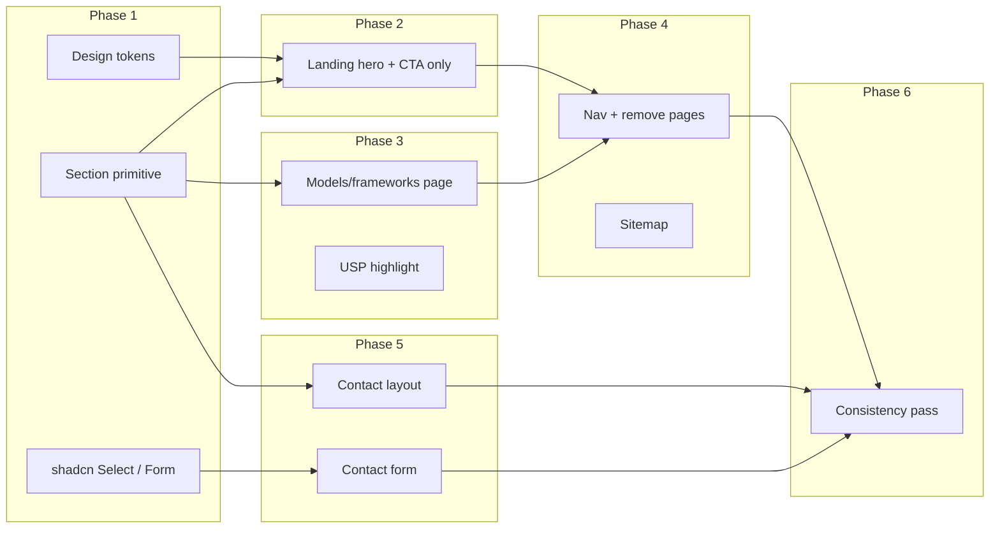

# Simplify MaestrosAI Website – Phased Implementation Plan

## Current state (summary)

- **Stack**: Next.js 16 (App Router), React 19, [shadcn/ui](components.json) (new-york, Radix primitives), Tailwind 4, IBM Plex Sans/Serif, Geist Mono.
- **Design tokens** ([app/globals.css](app/globals.css)): `--ink`, `--surface`, `--muted`, `--accent`, `--highlight` (oklch); utilities `bg-aurora`, `bg-grid-elevated`, `card-elevated`.
- **Pages**: Home (Hero + ProblemStatement + CTABanner), Solutions, Capabilities, Use Cases, How it Works, Impact, Contact, Privacy, Terms.
- **Key components**: [Hero](components/marketing/Hero.tsx), [Navbar](components/nav/Navbar.tsx), [Footer](components/footer/Footer.tsx), [ContactForm](components/marketing/ContactForm.tsx); UI primitives in `components/ui/` (button, card, container, input, etc.).

---

## Phase 1: Design system and component library consolidation

**Goal:** One consistent, modern component set and clear design tokens. No visual change yet.

- **Keep and document** the existing palette and type in [app/globals.css](app/globals.css) (ink, surface, muted, accent, highlight; radius; fonts). Optionally add a short comment block at the top listing “design language” for future reference.
- **Standardise on shadcn** as the single component library: ensure all surfaces use `Button`, `Card`, `Input`, `Label`, `Container` from `@/components/ui`. Add shadcn `Select` (and optionally `Form` from shadcn) so Contact no longer uses a raw `<select>`.
- **Introduce a shared `Section` primitive** (or reuse [components/ui/section.tsx](components/ui/section.tsx) if it exists) for consistent vertical rhythm (e.g. `py-16`/`py-24`) and optional `Container` wrapping, used on every page.
- **Skill (frontend-design):** Keep IBM Plex Sans/Serif and existing oklch palette; they already avoid generic AI aesthetics (Inter, purple gradients). Document the chosen direction as “refined minimalism” so implementation stays intentional.
- **Outcome:** Design tokens unchanged; all new/updated UI goes through the same primitives; ContactForm ready to use Select/Form in Phase 5.

---

## Phase 2: Landing page – hero and CTA only

**Goal:** Home is a blank slate: one hero, one CTA block. Everything else removed from the home page.

- **Replace** [app/(marketing)/page.tsx](<app/(marketing)/page.tsx>) with only:
  - **Hero** – headline, subhead, primary CTA (e.g. “Request a demo” → `/contact`), optional secondary CTA (e.g. “Explore solutions” → `/solutions`).
  - **Single CTA section** – short line of copy + one button (e.g. “Request a tailored walkthrough” → `/contact`).
- **Content:** Simplify [content/marketing/home.ts](content/marketing/home.ts) to `hero` and `cta` only; remove `problem`, `solutions`, `capabilities`, `useCases`, `whyUs`, `howItWorks`, `impact` from home usage (keep in file only if reused elsewhere, e.g. solutions page).
- **Hero component:** Keep [components/marketing/Hero.tsx](components/marketing/Hero.tsx) but optionally simplify (e.g. remove the “Where MaestrosAI shows up” aside, or make it configurable and hide it for the minimal home). Preserve `bg-aurora`, `bg-grid-elevated`, and existing typography/colour usage so the design language stays intact.
- **Outcome:** Home = Hero + one CTA section only; colour palette and design language preserved.

---

## Phase 3: Dedicated models/frameworks page and USP

**Goal:** One dedicated page that lists the four models/frameworks and clearly highlights the USP “Agentic AI driven insurance model office”.

- **Route:** Repurpose [app/(marketing)/solutions/page.tsx](<app/(marketing)/solutions/page.tsx>) (or add a new route, e.g. `/solutions` or `/models`) as the “Models & frameworks” page.
- **Content – four offerings:**
  1. **Agentic AI driven insurance model office** (USP – highlight)
  2. Agentic AI solution for climate risk
  3. Transforming legacy systems in agentic workflows
  4. AI driven dynamic MI dashboards with predictive capabilities
- **Layout:** Use the shared `Section` + `Container`. For each offering use a single pattern: e.g. Card or a simple list with title + short description. Make “Agentic AI driven insurance model office” visually dominant (e.g. first or featured card, different style, or a short “Our key offering” block above/below the list).
- **Content source:** New content file, e.g. `content/marketing/solutions.ts` or a section in `home.ts`, with titles and 1–2 line descriptions for each item; USP copy for the highlighted one.
- **Outcome:** One page that is simple, attractive, and informative; USP is unmistakable.

---

## Phase 4: Navigation and removal of obsolete pages

**Goal:** Only the pages that support the simplified story remain; nav and sitemap reflect that.

- **Pages to remove or redirect:**
  - [app/(marketing)/capabilities/page.tsx](<app/(marketing)/capabilities/page.tsx>), [app/(marketing)/use-cases/page.tsx](<app/(marketing)/use-cases/page.tsx>), [app/(marketing)/how-it-works/page.tsx](<app/(marketing)/how-it-works/page.tsx>), [app/(marketing)/impact/page.tsx](<app/(marketing)/impact/page.tsx>) → 404 or redirect to `/solutions` (or `/models`) and/or `/contact`.
- **Navbar** ([components/nav/Navbar.tsx](components/nav/Navbar.tsx)): Links to **Home**, **Solutions** (or **Models**), **Contact**. Keep “Request a demo” button. Remove Solutions/Capabilities/Use Cases as separate nav items; one “Solutions” or “Models” that goes to the new models/frameworks page.
- **Footer** ([components/footer/Footer.tsx](components/footer/Footer.tsx)): Minimal: brand, copyright, and optional links (e.g. Contact, Solutions, Privacy, Terms).
- **Sitemap** ([app/sitemap.ts](app/sitemap.ts)): Include only: `/`, `/solutions` (or chosen route), `/contact`, `/privacy`, `/terms` (if those pages stay).
- **Cleanup:** Delete or archive unused marketing components (e.g. ProblemStatement, WhyUs, HowItWorks, Impact, SolutionOverview, UseCases, Capabilities) if no longer referenced; keep Hero and CTABanner (and any reused in solutions page).
- **Outcome:** Clear information architecture: Home → Solutions (models/frameworks) → Contact; legal pages linked from footer.

---

## Phase 5: Contact page and form – simplified and elegant

**Goal:** Contact page and form feel simple, attractive, and informative without clutter.

- **Page layout** ([app/(marketing)/contact/page.tsx](<app/(marketing)/contact/page.tsx>)):
  - One clear header (e.g. “Get in touch” / “Request a demo”) with a short line of copy.
  - Single column or simple two-column (short context + form).
  - Remove heavy decorative elements (e.g. carbon texture, multiple accent blurs, “STATUS: LISTENING” block) in favour of whitespace and typography.
  - Use shared `Section` + `Container` and design tokens (ink, accent, muted) for consistency.
- **Form** ([components/marketing/ContactForm.tsx](components/marketing/ContactForm.tsx)):
  - Reduce fields to essentials: e.g. Name, Email, Company, Message; optionally keep Role and Area as optional or a single “Interest” dropdown.
  - Replace raw `<select>` with shadcn `Select` (and optional `Form` + react-hook-form) for consistency and accessibility.
  - Same validation and [app/api/contact/route.ts](app/api/contact/route.ts) contract; adjust schema in [lib/contact.ts](lib/contact.ts) if fields are removed or made optional.
  - Success state: keep one clear success message and “Send another message”; style with design tokens.
- **Skill (vercel-react-best-practices):** Keep submit logic in the form's submit handler (no state + effect). Ensure form inputs have proper labels and focus handling for accessibility.
- **Outcome:** Contact is easy to scan and use; form is consistent with the rest of the UI.

---

## Phase 6: Component consistency and polish

**Goal:** Every remaining page uses the same layout and component patterns; design feels uniform.

- **Audit:** Home, Solutions (models/frameworks), Contact, Privacy, Terms – all use `Container`, `Section`, same `Button` variants (`accent`, `outline`), same `Card` style where applicable.
- **Typography:** One pattern for page titles (e.g. `font-serif` + size/weight) and body (e.g. `font-sans`); reuse across Solutions and Contact.
- **Remove or refactor** any one-off classes that duplicate token-based styles; prefer `text-ink`, `text-muted-foreground`, `bg-surface`, `border-border`, etc.
- **Motion (frontend-design):** One high-impact moment beats scattered micro-interactions. Add a single well-orchestrated touch: e.g. staggered reveal on Solutions cards on scroll, or hero CTA hover. Use CSS/Motion with restraint to match “refined minimalism.”
- **Optional:** Run a pass against [Web Interface Guidelines](https://raw.githubusercontent.com/vercel-labs/web-interface-guidelines/main/command.md) for key pages (Home, Solutions, Contact): focus management, labels, contrast, semantic structure ([web-design-guidelines skill](.agents/skills/web-design-guidelines/SKILL.md)).
- **Outcome:** Site-wide consistency; design language “simple, attractive, informative” applied uniformly.

---

## Skill alignment and implementation notes

These notes align the plan with project skills so implementation stays consistent and performant.

- **Frontend-design ([.agents/skills/frontend-design/SKILL.md](.agents/skills/frontend-design/SKILL.md)):** The site direction is “simple, attractive, informative” with refined minimalism. Keep typography (IBM Plex), colour (ink/surface/accent/highlight), and utilities (bg-aurora, bg-grid-elevated). Avoid generic AI look (Inter, purple gradients, predictable layouts). Match implementation complexity to the vision: restraint, spacing, and subtle detail over heavy effects.
- **Vercel React best practices ([.agents/skills/vercel-react-best-practices/SKILL.md](.agents/skills/vercel-react-best-practices/SKILL.md)):** When implementing: (1) Prefer direct imports for heavy packages (e.g. lucide-react) or enable `optimizePackageImports` in next.config. (2) Use ternary for conditional rendering where the value can be 0/falsy (`rendering-conditional-render`). (3) Keep contact submit logic in the event handler, not state + effect. (4) In the contact API route, start independent work early and use `after()` for non-blocking side effects (e.g. logging) if needed. (5) Pass only needed props from server to client to minimize serialization at RSC boundaries.
- **Web-design-guidelines ([.agents/skills/web-design-guidelines/SKILL.md](.agents/skills/web-design-guidelines/SKILL.md)):** In Phase 6 (or before release), optionally fetch the latest [Web Interface Guidelines](https://raw.githubusercontent.com/vercel-labs/web-interface-guidelines/main/command.md) and review Home, Solutions, and Contact for accessibility, focus, contrast, and structure.

---

## Dependency overview

---

## Suggested implementation order

| Phase | Focus                      | Deliverables                                                              |
| ----- | -------------------------- | ------------------------------------------------------------------------- |
| 1     | Design system & components | Tokens documented; shadcn Select (+ Form); Section; all UI via primitives |
| 2     | Landing                    | Home = Hero + one CTA; home copy trimmed                                  |
| 3     | Models/frameworks + USP    | Solutions (or Models) page with 4 items + USP emphasis                    |
| 4     | Navigation & cleanup       | Nav/Footer updated; obsolete pages removed/redirected; sitemap updated    |
| 5     | Contact                    | Contact layout simplified; form reduced and using Select/Form             |
| 6     | Polish                     | Audit and align typography, spacing, and components across all pages      |

---

## Files to touch (by phase)

- **Phase 1:** [app/globals.css](app/globals.css), [components/ui/section.tsx](components/ui/section.tsx) (create or update), add shadcn Select (and optionally Form); [components/marketing/ContactForm.tsx](components/marketing/ContactForm.tsx) only if switching to Select in this phase (otherwise Phase 5).
- **Phase 2:** [app/(marketing)/page.tsx](<app/(marketing)/page.tsx>), [content/marketing/home.ts](content/marketing/home.ts), [components/marketing/Hero.tsx](components/marketing/Hero.tsx) (optional simplify).
- **Phase 3:** [app/(marketing)/solutions/page.tsx](<app/(marketing)/solutions/page.tsx>) (or new route), new content file for solutions/models, new or reused section components for the list and USP.
- **Phase 4:** [components/nav/Navbar.tsx](components/nav/Navbar.tsx), [components/footer/Footer.tsx](components/footer/Footer.tsx), [app/sitemap.ts](app/sitemap.ts); delete or redirect capabilities, use-cases, how-it-works, impact routes and optionally remove unused components.
- **Phase 5:** [app/(marketing)/contact/page.tsx](<app/(marketing)/contact/page.tsx>), [components/marketing/ContactForm.tsx](components/marketing/ContactForm.tsx), [lib/contact.ts](lib/contact.ts); [app/api/contact/route.ts](app/api/contact/route.ts) only if schema changes.
- **Phase 6:** All remaining pages and shared components; minor globals.css if needed.

This keeps the existing colour palette and design language, makes the site simple and informative, and delivers a clear models/frameworks page with the requested USP emphasis and a streamlined contact experience.
